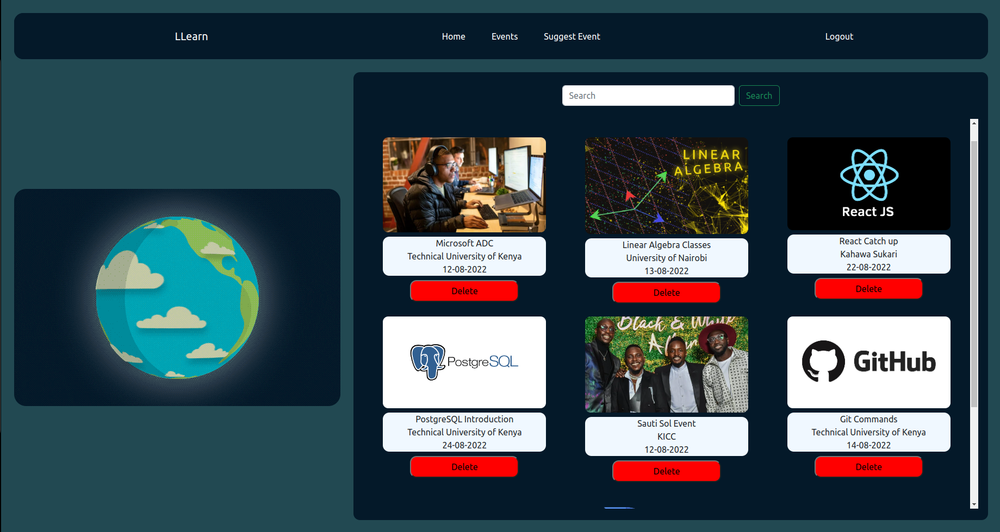
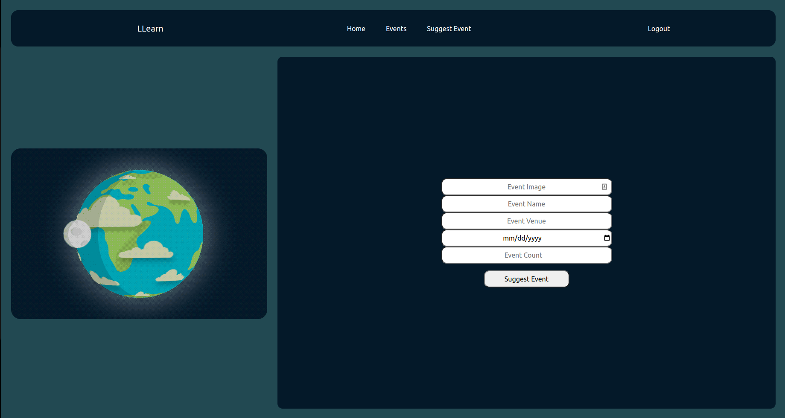

# LLearn

### Created by Joash Omao Machoka on October 4th 2022

## Description

Lets Learn(LLearn) is an online resgister that allows event organizers e.g lecturers or anyone else who wishes to take up the role to simply create or suggest an event. Sharing the link to the event will allow users to register for the event. This allows the event organizer to keep track of who will be attending the event/meetup.

## Screenshots
The home page displays a list of all the events that the user has created for others to join or register for.

## Link to the Website

## Setup Requirements
1. Visual Studio Code IDE
2. Chrome Web Browser
4. Git
5. Github (https://github.com/omaomach/LLearn)
6. JSON server (https://www.npmjs.com/package/json-server)
7. NPM (https://docs.npmjs.com/downloading-and-installing-node-js-and-npm) and NPX

## Development Server
The database for the website was run and supported by JSON server. Run json-server --watch db.json on the terminal to get the server running on port http://localhost:3000

## Languages Used
* HTML 5
* Bootstrap
* CSS
* Markup
* React JS

## Design Tools
I designed the site using pencil and paper. The designs are as below:

## Known Bugs
The project has no known Bugs

## Support and Contact Details
In the case that the project becomes captivating to the user in that he/she may want to share ideas on how to improve it, please contact me using my github email:

* aaronjoash44@gmail.com

## License
This project and app have no license or any copyright. They are free for use by anyone as long the usage is legal.  
